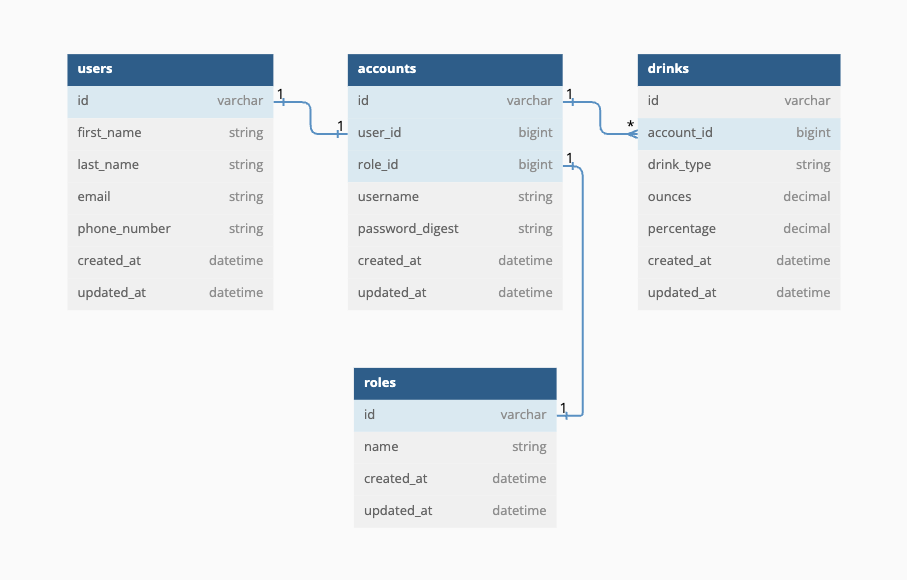

# Taper

An educational health and wellness web application that allows users to track their alcoholic unit consumption by entering in values for a drink’s ounces and alcohol-by-volume (ABV) percentage.

### Local Setup

1. Navigate to Repo

```
cd taper
```

2. Install Dependencies

```
bundle install
```

3. Create a New Database

```
rails db:{drop,create,migrate,seed}
```

4. Run the Development Server

```
open http://localhost:3000/

rails s
```

5. Login to the Application

```
Username: bob123
Password: Password123!
```

### How It Works

Users first create an account and then login to the application, where they will see three different pages:

* The **Dashboard** Page - A page that lists the total alcoholic units and total drink count consumed for today, the current week, the current year, as well as all-time. Additionally, there is a weekly breakdown section where each week lists the units and drink count consumed from that particular week.

* The **New Drink** Page - A page that allows a user to enter a new drink to track by entering a drink's ounces and alcohol-by-volume (ABV) percentage.

* The **All Drinks** Page - A page that lists all of a user's logged drinks.

### Versions

- Ruby 3.2.2
- Rails 7.1.3.4

### Database Schema



### Key Features

- [x] A user can successfully create a new account
- [x] A user can login to the application with an account
- [x] A user can create a new drink
- [x] A user can update an existing drink
- [x] A user can delete an existing drink

### Tests

* 85 Total Tests (980 / 980 LOC (100%) covered), 1 Pending
* 31 Feature Tests (696 / 696 LOC (100%) covered), 1 Pending
* 54 Model Tests (243 / 243 LOC (100.0%) covered)